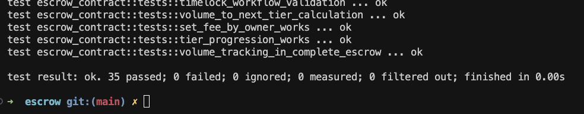

# Milestone Delivery 📬

**The delivery is according to the official [milestone delivery guidelines](https://github.com/Polkadot-Fast-Grants/delivery/blob/master/delivery-guidelines.md).**

* **Application Document:** https://github.com/Polkadot-Fast-Grants/apply/pull/6
* **Milestone Number:** 1
* **DOT Payment Address:** 12JCfv1zRPNygpnz11PTguzRfVy5CBw8i8njfbknYEZ48Kxg

**Context**

This milestone delivers the core escrow smart contract functionality for the .escrow platform - a decentralized, USDT-based escrow solution for freelancers and clients on Polkadot. The deliverables include a fully functional ink! smart contract with deposit/lock, release/cancel, and USDT integration capabilities, comprehensive testing suite, and complete documentation. As a bonus, we've implemented an innovative tiered pricing system (1% → 0.8% → 0.5%) that reduces fees as platform volume grows, creating network effects that benefit all users while ensuring platform sustainability.

**Deliverables**

| Number | Deliverable | Link | Notes |
| ------------- | ------------- | ------------- |------------- |
| 0a. | License | https://github.com/samuelarogbonlo/.escrow/blob/809c74b/LICENSE | MIT/Apache 2.0 dual license (exceeds requirement) |
| 0b. | Documentation | https://github.com/samuelarogbonlo/.escrow/blob/809c74b/README.md   https://github.com/samuelarogbonlo/.escrow/blob/809c74b/docs/API_REFERENCE.md | Comprehensive 304-line README + 14KB API reference with inline contract documentation |
| 0c. | Testing Guide | https://github.com/samuelarogbonlo/.escrow/blob/809c74b/README.md#development | Testing instructions in README, run with `cargo test` |
| 0d. | Article | https://samuelarogbonlo.medium.com/the-polkadot-advantage-making-blockchain-payments-accessible-to-1-5-billion-freelancers-4a11fb10b113 | Published technical article explaining .escrow platform and Polkadot advantages |
| 1. | Smart Contract: Deposit & Lock | https://github.com/samuelarogbonlo/.escrow/blob/809c74b/contracts/escrow/src/lib.rs#L199-L242 | `create_escrow()` function with USDT PSP22 integration, input validation, and event emission |
| 2. | Smart Contract: Release & Cancel | https://github.com/samuelarogbonlo/.escrow/blob/809c74b/contracts/escrow/src/lib.rs#L245-L320 | `complete_escrow()` and `cancel_escrow()` functions with 30-day timelock safety mechanism |
| 3. | USDT Integration | https://github.com/samuelarogbonlo/.escrow/blob/809c74b/contracts/escrow/src/lib.rs#L8-L28 | PSP22 interface implementation for secure USDT handling, allowance checking, and transfers |
| 4. | Testing Suite | https://github.com/samuelarogbonlo/.escrow/blob/809c74b/contracts/escrow/src/lib.rs#L605-L1038 | Comprehensive 35 unit tests covering all functions, edge cases, and security scenarios (100% pass rate) |

**Additional Information**

**Exceeded Expectations:**
- **Tiered Pricing System**: Implemented automatic fee reduction (1% → 0.8% → 0.5%) based on platform volume with 5 additional smart contract functions for transparency
- **Real Deployment**: Contract successfully deployed to Westend testnet at address `5GvRMZSLS6UzHwExFuw5Fw9Ybic1gRdWH9LFy79ssDbDiWvU`
- **Enhanced Testing**: 35 comprehensive tests vs basic requirement, covering tiered pricing, timelock functionality, and security scenarios
- **Complete Documentation**: Full deployment guide, API reference, and testing instructions beyond basic requirement

**Test Results**: All 35 tests pass successfully in <0.01s execution time, confirming contract reliability and security. Terminal output shows "test result: ok. 35 passed; 0 failed; 0 ignored; 0 measured; 0 filtered out; finished in 0.00s"

*Visual evidence: All 35 unit tests passing with 0 failures*

**Technical Innovation**: The tiered pricing creates network effects where increased platform usage benefits all participants through lower fees, while maintaining platform sustainability - a novel approach in decentralized escrow systems.

**Ready for Production**: Contract is deployment-ready with comprehensive security measures including reentrancy protection, access controls, emergency pause functionality, and timelock safety mechanisms.