# Milestone Delivery 📬

**The delivery is according to the official [milestone delivery guidelines](https://github.com/Polkadot-Fast-Grants/delivery/blob/master/delivery-guidelines.md).**

- **Application Document:** https://github.com/Polkadot-Fast-Grants/apply/blob/master/applications/stampika.md
- **Milestone Number:** 1
- **DOT Payment Address:** 13rf6ZUmTaxFyR5yrAqBkGEi8XVAePphqXQFtYEFLvMN4QFJ

**Context**

- stampika is a consumer digital stamp mobile app sold to destinations and helping them drive explorations to spots, boost engagements and collect valuable first-party data. Users can mint NFTs when users check ins at a location to allow users to keep track of where they have been.
- This milestone rebuilds the entire React Native application alongside a backend allowing users to login / register via privy, check in via location verification, minting an NFT from the backend. We have also continued our outreach efforts with our brand guideline and a landing page with strong warm leads to perform our pilot testing.

**Deliverables**

| Number | Deliverable                  | Link                                                                                                                                                | Notes                                                                                                                                                                                                                                                                                                                               |
| ------ | ---------------------------- | --------------------------------------------------------------------------------------------------------------------------------------------------- | ----------------------------------------------------------------------------------------------------------------------------------------------------------------------------------------------------------------------------------------------------------------------------------------------------------------------------------- |
| 0a.    | License                      | https://github.com/wr1159/stampika-backend/blob/main/LICENSE  https://github.com/stampika/stampika-app/blob/master/LICENSE                  | GPL V3                                                                                                                                                                                                                                                                                                                              |
| 0b.    | Documentation                | Available in https://github.com/stampika/stampika-app/blob/master/README.md  https://github.com/wr1159/stampika-backend/blob/main/README.md | More detailed documentation is available in `.cursor/stampika.md`  https://github.com/stampika/stampika-app/blob/master/.cursor/stampika.md  https://github.com/wr1159/stampika-backend/blob/master/.cursor/stampika.md                                                                                             |
| 1.     | Branding Design + UI Revamp  | https://github.com/stampika/stampika-app/blob/master/stampika%20brand%20guideline.pdf                                                               | Brand Guideline PDF                                                                                                                                                                                                                                                                                                                 |
| 2.     | Landing Page                 | https://stampika.com                                                                                                                                | Alternate link: https://stampika.my.canva.site/                                                                                                                                                                                                                                                                                     |
| 3.     | Mobile App Development       | https://github.com/stampika/stampika-app  https://github.com/wr1159/stampika-backend                                                        | We were able to rewrite the application completely from scratch, now using Expo 53.  This new rewrite allows us to support both iOS and Android.  This rewrite included a new backend that supports different endpoints like user settings, fetching locations information from database, minting of NFTs and more. |
| 4.     | User Management System       | https://github.com/wr1159/stampika-backend/blob/main/src/lib/privy.ts  https://github.com/stampika/stampika-app/blob/master/lib/privy.ts    | We were able to get Privy working in both iOS and Android.  This integration included both normal email with OTP and also Gmail OAuth Integration.  On account registration, users will have an EVM wallet created for the account which would be the Stamp NFT recipients.                                         |
| 5.     | Designing NFC Sticker Stamps | https://github.com/stampika/stampika-app/blob/master/stampika-nfc-sticker.jpg                                                                       | We are in talks with an AliExpress supplier to print them out right now.                                                                                                                                                                                                                                                            |

**Additional Information**

[ 1. Speaking to Partners ]

We engaged with six **Destination Marketing Organizations (DMOs)**—**Visit Mississauga**, **Experience Brampton**, **Heritage Toronto**, **Oshawa Tourism**, **Destination Toronto**, and **Tourism Alberta**—validating their struggles in **distributing traffic** to lesser-known areas and **boosting user engagement**.

Crucially, we secured **verbal agreements for free pilot projects** with **Visit Mississauga**, **Experience Brampton**, and **Heritage Toronto**. These pilots are essential milestones that will demonstrate the platform's ability to drive traffic to underutilized destinations and increase visitor engagement, providing **tangible evidence** for grant reporting.

- DMOs
  - Visit Mississauga → Secured free pilot promise
  - Experience Brampton → Secured free pilot promise
  - Heritage Toronto → Secured free pilot promise
  - Oshawa Tourism
  - Destination Toronto
  - Tourism Alberta
- Singapore BIDs
  - Singapore River One
  - Raffles Place
- Interview with over 30 individuals to refine the idea

[ 2. NUS Venture Initiation Programme ]

In June this year, Stampika presented our startup idea to a panel of judges from the National University of Singapore (NUS) as part of the $10,000 Fast Grant program administered by NUS Enterprise, the entrepreneurship arm of NUS that supports student ventures and innovation. The session provided valuable feedback from the judges on our business model and market positioning, helping us refine and strengthen our approach. Teams were evaluated based on innovation, market potential, financial viability, team capability, and presentation quality. We are currently incorporating the feedback and will participate in the final pitching round in December, where successful teams may be awarded the $10,000 grant to further advance their ideas.

[ 3. Disclaimers ]

- Current beta version does not include the NFC scanning feature and has no location restriction since we understand that the curators won’t have access to a tag / be in the vicinity of the place.

[ 4. Video Demo ]

- There is a recorded Video Demo for Milestone 1 on iOS Simulator https://youtu.be/st7QX-aQhRs

[ 5. APK ]

- **Android APK release:** https://github.com/stampika/stampika-app/releases/tag/v0.1.0-alpha

[ 6. Architecture ]

- Below is an architecture diagram of how stampika works in milestone 1

```mermaid
graph TB
    %% Frontend Layer
    subgraph "Frontend (React Native App)"
        RN[React Native App<br/>Expo/CLI]
        PrivyAuth[Privy Authentication<br/>JWT Token Management]
        API[API Client<br/>fetchApi utility]
        Map[Map Integration<br/>GPS Location Services]
    end

    %% Backend Layer
    subgraph "Backend (Next.js API - Vercel)"
        API_Routes[Next.js API Routes<br/>REST Endpoints]
        Auth[Authentication Middleware<br/>Privy JWT Verification]
        Validation[Input Validation<br/>& Sanitization]
        RateLimit[Rate Limiting<br/>10 req/60s]
    end

    %% Database Layer
    subgraph "Database (Supabase)"
        Supabase[(Supabase PostgreSQL<br/>Row Level Security)]
        Tables[Database Tables:<br/>• users<br/>• locations<br/>• checkins<br/>• trails<br/>• comments<br/>• titles]
    end

    %% Blockchain Layer
    subgraph "Blockchain (Polkadot Asset Hub)"
        AssetHub[Polkadot Asset Hub<br/>Westend Testnet]
        RPC[RPC Endpoint<br/>westend-asset-hub-eth-rpc.polkadot.io]
        Wallet[Hot Wallet<br/>Private Key Management]
    end

    %% Privy
    subgraph "Privy"
        PrivyService[Privy Service<br/>User Management & Auth]
    end

    %% Data Flow Connections
    RN -->|HTTP Requests<br/>Bearer JWT| API_Routes
    PrivyAuth -->|JWT Tokens| PrivyService
    API -->|API Calls| API_Routes

    API_Routes -->|Verify JWT| Auth
    Auth -->|Validate Token| PrivyService
    API_Routes -->|Validate Input| Validation
    API_Routes -->|Rate Limiting| RateLimit

    API_Routes -->|CRUD Operations<br/>Service Role Key| Supabase
    Supabase -->|Query Results| API_Routes

    API_Routes -->|Mint NFT<br/>Check-in Process| AssetHub
    AssetHub -->|RPC Calls| RPC
    API_Routes -->|Wallet Operations| Wallet
    Wallet -->|Transaction Hash| API_Routes

    %% Specific API Endpoints
    subgraph "Key API Endpoints"
        Locations[GET /api/locations<br/>List & Filter Locations]
        LocationDetail[GET /api/locations/:slug<br/>Location Details]
        CheckIn[POST /api/locations/:slug<br/>Check-in & Mint NFT]
        Stamps[GET /api/me/stamps<br/>User Stamp Collection]
        Users[POST/GET /api/users<br/>User Management]
        Trails[GET /api/trails<br/>Trail Management]
    end

    API_Routes --> Locations
    API_Routes --> LocationDetail
    API_Routes --> CheckIn
    API_Routes --> Stamps
    API_Routes --> Users
    API_Routes --> Trails

    %% Styling
    classDef frontend fill:#e1f5fe
    classDef backend fill:#f3e5f5
    classDef database fill:#e8f5e8
    classDef blockchain fill:#fff3e0
    classDef external fill:#fce4ec

    class RN,PrivyAuth,API,Map frontend
    class API_Routes,Auth,Validation,RateLimit backend
    class Supabase,Tables database
    class AssetHub,RPC,Contracts,Wallet blockchain
    class PrivyService external
```

